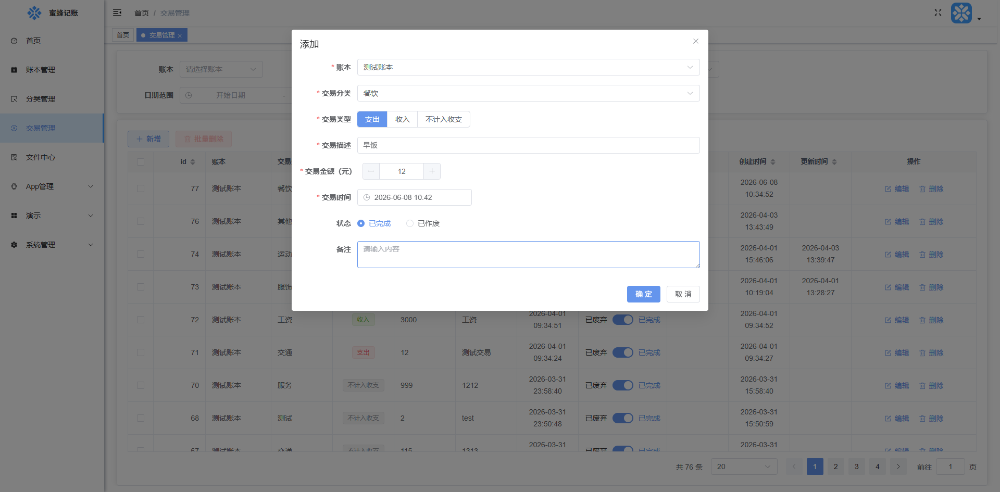

# 蜜蜂记账

一款简洁的跨平台个人记账工具，支持 PC Web 端与移动 App 双端同步，轻松管理日常收支。

## 核心功能

-   **快速记账**：支持支出/收入记录，分类选择、备注填写，操作流畅
-   **交易管理**：明细列表展示，支持编辑、作废、状态标记
-   **数据统计**：实时收支摘要、趋势折线图、分类占比饼图、Top10 排行
-   **多账本支持**：可创建多个账本，适配个人/家庭多场景
-   **双端同步**：PC 与 App 数据实时同步，随时随地查看

## 系统目录
- **bee-budget-backend**：后端服务，，提供 RESTful API、数据存储与业务逻辑处理，基于 .Net10 实现
- **bee-budget-frontend**：PC Web 前端，基于 Vue3 实现的响应式管理后台
- **bee-budget-app**：移动端应用，基于 UniApp Vue2 实现，目前支持 Android/H5

## 界面预览

| 移动端 | PC 端 |
| :---: | :---: |
|   |   |

## 演示环境

1.  访问 PC 端网址或下载 App
2.  登录管理员账号：admin 密码：123456

